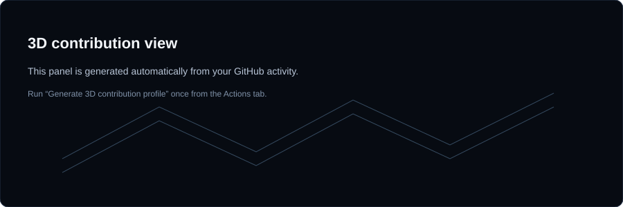

<!-- HERO -->

  

<!-- SOCIALS -->

&nbsp;

&nbsp;

  

<!-- ABOUT -->
<table align="center" width="92%">
<tr>
<td width="62%" valign="middle">

<h2 align="left">
  
  <i>About Me</i>
</h2>

I'm <b>Haashim</b> — an Artificial Intelligence & Machine Learning engineering student and builder who enjoys turning real-world problems into useful technology.

I'm interested in <b>AI/ML, full-stack development, computer vision, robotics and product engineering</b>.

I enjoy building projects, participating in hackathons and experimenting with new technologies.

 

<b>Currently:</b> Building · Learning · Experimenting · Competing

</td>

<td width="38%" align="center">

</td>
</tr>
</table>

 

<!-- TECHNOLOGIES -->
<h2 align="center">
  
  <i>Technologies</i>
</h2>

 

 

 

  

<!-- GITHUB STATISTICS -->
<h2 align="center">
  
  <i>Statistics</i>
</h2>

 

<!-- REAL GITHUB STATS -->

  

  

 

<!-- CONTRIBUTION GRAPH -->

  

 

<!-- STREAK GRAPH -->

  

 

<!-- CONTRIBUTION HEATMAP -->
<h2 align="center">
  
  <i>Contribution Graph</i>
</h2>

 

  

  

<!-- 3D CONTRIBUTION -->
<h2 align="center">
  
  <i>3D Contribution View</i>
</h2>

 

  

  

<!-- WHAT I BUILD -->
<h2 align="center">
  
  <i>What I Build</i>
</h2>

 

<table align="center" width="92%">
<tr>

<td width="33%" align="center">

<b>AI / ML</b>

  

Computer Vision 
Machine Learning 
Intelligent Systems

</td>

<td width="33%" align="center">

<b>FULL-STACK</b>

  

Web Applications 
APIs & Databases 
Product Systems

</td>

<td width="33%" align="center">

<b>EXPERIMENTS</b>

  

Hackathons 
Robotics 
New Technologies

</td>

</tr>
</table>

  

<!-- PROJECT MINDSET -->
<h2 align="center">
  
  <i>Beyond Code</i>
</h2>

 

<table align="center" width="92%">
<tr>

<td width="50%" valign="top">

<b>Hackathons & Building</b>

  

I enjoy turning ideas into working prototypes, especially when there is a real problem, constraint or deadline involved.

</td>

<td width="50%" valign="top">

<b>Learning & Exploring</b>

  

AI systems, product engineering, computer vision, robotics and whatever technology can make the next project more interesting.

</td>

</tr>
</table>

  

<!-- FOOTER -->

  Always building. Always learning. Always shipping.

 

  <a href="https://github.com/HAFIZ-HAASHIM">GitHub</a>
  &nbsp;·&nbsp;
  <a href="https://www.linkedin.com/in/muhammad-haashim-49051828b">LinkedIn</a>
  &nbsp;·&nbsp;
  <a href="https://www.instagram.com/haashim.dev/">Instagram</a>

