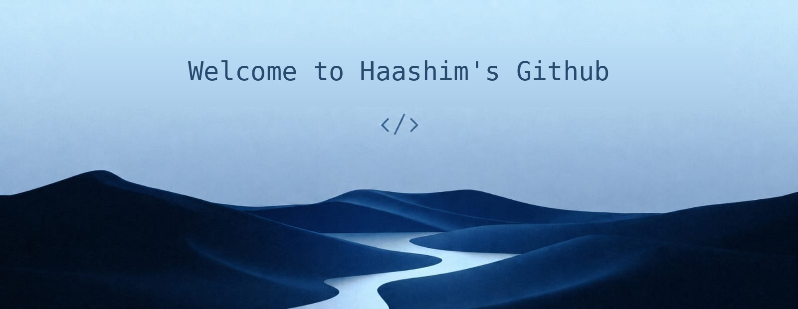
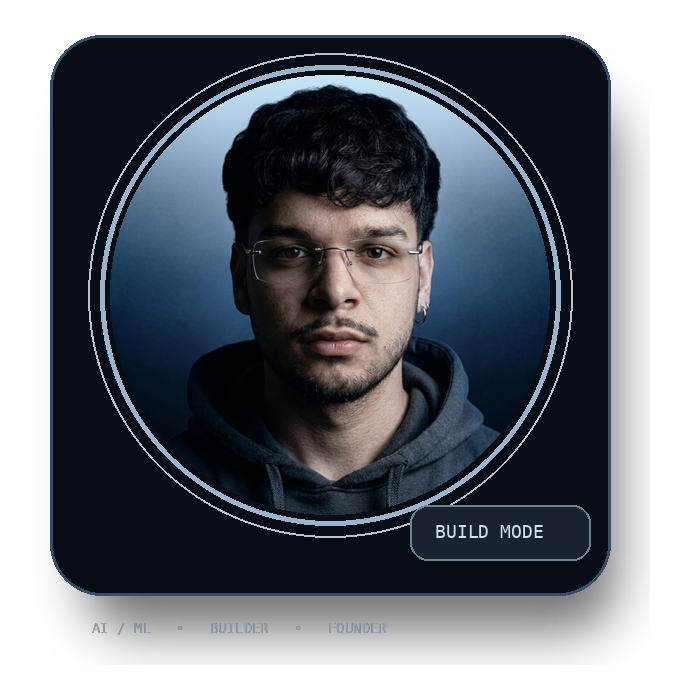
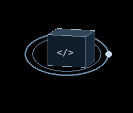
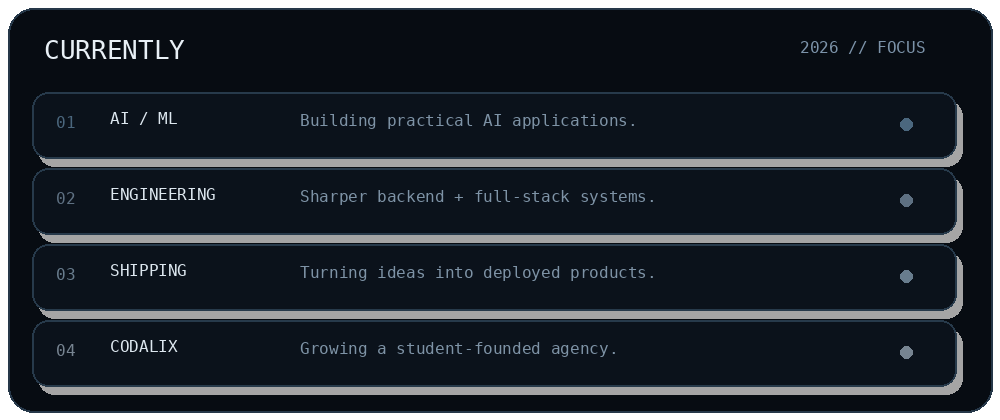

 

 

<h2 align="center">
  
  <i>Technologies</i>
</h2>

  

  Vertex AI · Roboflow · Firestore · AI APIs · Speech-to-Text · IoT · Robotics

<h2 align="center">
  
  <i>Statistics</i>
</h2>

  
  

  

  

<h2 align="center">
  
  <i>About Me</i>
</h2>

<table>
<tr>
<td width="35%" align="center" valign="middle">

</td>
<td width="65%" valign="middle">

I'm **Muhammad Haashim**, a second-year **B.E. Artificial Intelligence & Machine Learning** student at **St Joseph Engineering College**.

I build practical software around real-world problems — AI-powered applications, full-stack products, rapid prototypes, robotics and experiments.

Previously, I completed a **Diploma in Computer Science & Engineering** at Bearys Institute of Technology, where I was an **Academic Topper for two consecutive years**.

I'm also the founder of **Codalix**, a student-founded technology agency.

</td>
</tr>
</table>

 

  

<h2 align="center">
  
  <i>What I Build</i>
</h2>

<table>
<tr>
<td width="50%" valign="top">

### ◉ AI Products

AI-powered applications designed around actual problems.

`Python` `AI APIs` `Vertex AI`

</td>
<td width="50%" valign="top">

### ◇ Full-Stack Systems

Web products, backends, APIs and data systems.

`React` `Next.js` `Node.js`

</td>
</tr>
<tr>
<td width="50%" valign="top">

### △ Experiments

Robotics, IoT and rapid prototypes.

`Arduino` `IoT` `Embedded`

</td>
<td width="50%" valign="top">

### ◌ Products

Ideas pushed beyond the prototype into usable products.

`Build` `Deploy` `Iterate`

</td>
</tr>
</table>

<h2 align="center">
  
  <i>Featured Work</i>
</h2>

<table>
<tr>
<td width="50%" valign="top">

### GraamSehat

**Offline-first rural healthcare suite**

Five connected applications designed for villagers, ASHA workers and administration.

`JavaScript` `Firebase` `Firestore` `PWA`

<a href="https://github.com/HAFIZ-HAASHIM/GraamSehat">Repository →</a>
&nbsp; <a href="https://graam-sehat.vercel.app">Live Demo →</a>

</td>
<td width="50%" valign="top">

### ThermoShift

**Heat-aware workforce scheduling**

Decision support for safer outdoor work/rest scheduling.

`Python` `FastAPI` `React` `OR-Tools`

<a href="https://github.com/HAFIZ-HAASHIM/thermoshift">Repository →</a>
&nbsp; <a href="https://thermoshift.vercel.app">Live Demo →</a>

</td>
</tr>
<tr>
<td width="50%" valign="top">

### HarvestIQ

**AI crop-selling advisor**

Market forecasting, weather insights and alerts for farmers.

`Node.js` `Firebase` `Twilio`

<a href="https://github.com/HAFIZ-HAASHIM/HarvestIQ">Repository →</a>

</td>
<td width="50%" valign="top">

### Rezolvia

**Dynamic college platform**

Practical web platform built with PHP and MySQL.

`PHP` `MySQL` `HTML` `CSS`

<a href="https://rezolvia.in/">Live Website →</a>

</td>
</tr>
</table>

<h2 align="center">
  
  <i>Proof of Work</i>
</h2>

  
  
  
  

<h2 align="center">
  
  <i>Currently</i>
</h2>

  

<h2 align="center">
  
  <i>More Things I've Built</i>
</h2>

<b>Open project list</b>

 

**BlueGuard AI** · **Acadex** · **ClubMate** · **HemaScan** · **Project Kisan** · **WonderWing Travel & Tourism** · **Nxt Bus** · **School Lane** · **Line Following Robot** · **Maze Solver Robot**

 

<h2 align="center">
  
  <i>Codalix</i>
</h2>

  <b>Student-founded technology agency.</b> 
  Building websites, digital products and practical technology solutions.
    
  

 

  <i>“Build useful things. Keep learning. Keep shipping.”</i>
    
  <a href="https://github.com/HAFIZ-HAASHIM">GitHub</a>
  &nbsp;•&nbsp;
  <a href="https://www.linkedin.com/in/muhammad-haashim-49051828b">LinkedIn</a>
  &nbsp;•&nbsp;
  <a href="https://codalix.in">Codalix</a>
  &nbsp;•&nbsp;
  <a href="mailto:haashimmuhammad7@gmail.com">Email</a>

