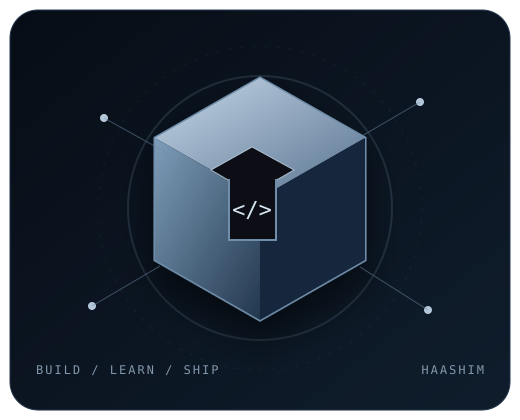

 

 

<h2 align="center">⚙️ <i>Technologies</i></h2>

  

Vertex AI · Roboflow · Firestore · AI APIs · Speech-to-Text · IoT · Robotics

<h2 align="center">📊 <i>Statistics</i></h2>

  
  

  

<h2 align="center">👋 <i>About Me</i></h2>

<table width="100%">
<tr>
<td width="62%" valign="middle">

I'm **Muhammad Haashim**, a second-year **B.E. Artificial Intelligence & Machine Learning** student at **St Joseph Engineering College**.

I enjoy taking real problems and turning them into working software — from AI-powered applications and full-stack products to robotics and experimental systems.

I previously completed a **Diploma in Computer Science & Engineering** at Bearys Institute of Technology, where I was an **Academic Topper for two consecutive years**.

Right now I'm focused on becoming a stronger engineer by **building, shipping, competing and learning**.

</td>
<td width="38%" align="center" valign="middle">

</td>
</tr>
</table>

<h2 align="center">🚀 <i>Featured Work</i></h2>

<table width="100%">
<tr>
<td width="50%" valign="top">

### GraamSehat
**Offline-first rural healthcare suite**

A connected system designed around villagers, ASHA workers, administration and low-connectivity environments.

`JavaScript` `Firebase` `Firestore` `PWA`

<a href="https://github.com/HAFIZ-HAASHIM/GraamSehat">Repository →</a> · <a href="https://graam-sehat.vercel.app">Live Demo →</a>

</td>
<td width="50%" valign="top">

### ThermoShift
**Heat-aware workforce scheduling**

Decision support for safer outdoor work/rest scheduling using weather-aware logic and constraint optimisation.

`Python` `FastAPI` `React` `OR-Tools`

<a href="https://github.com/HAFIZ-HAASHIM/thermoshift">Repository →</a> · <a href="https://thermoshift.vercel.app">Live Demo →</a>

</td>
</tr>
<tr>
<td width="50%" valign="top">

### HarvestIQ
**AI crop-selling advisor**

Market-price forecasting, weather risk and alerts designed to support better selling decisions.

`Node.js` `Firebase` `Twilio`

<a href="https://github.com/HAFIZ-HAASHIM/HarvestIQ">Repository →</a>

</td>
<td width="50%" valign="top">

### Rezolvia
**Dynamic college platform**

A practical web platform built with PHP and MySQL.

`PHP` `MySQL` `HTML` `CSS`

<a href="https://rezolvia.in/">Live Website →</a>

</td>
</tr>
</table>

<h2 align="center">🏆 <i>Achievements</i></h2>

  
  
  
  

  Academic Topper · two consecutive years · Diploma in CSE · Google Solution Challenge · Google Agentic AI Day

<h2 align="center">🎯 <i>Current Focus</i></h2>

  

<h2 align="center">✨ <i>More Things I've Built</i></h2>

<b>Open project list</b>

 

**BlueGuard AI** · **Acadex** · **ClubMate** · **HemaScan** · **Project Kisan** · **WonderWing Travel & Tourism** · **Nxt Bus** · **School Lane** · **Line Following Robot** · **Maze Solver Robot**

<h2 align="center">⚡ <i>Codalix</i></h2>

  <b>Student-founded technology agency.</b> 
  Building websites, digital products and practical technology solutions.

  <a href="https://codalix.in"><b>VISIT CODALIX →</b></a>

 

  <b>BUILD SOMETHING USEFUL.</b> 
  AI · SOFTWARE · PRODUCTS · REAL-WORLD PROBLEMS
    
  <a href="https://github.com/HAFIZ-HAASHIM">GitHub</a> ·
  <a href="https://www.linkedin.com/in/muhammad-haashim-49051828b">LinkedIn</a> ·
  <a href="https://codalix.in">Codalix</a> ·
  <a href="mailto:haashimmuhammad7@gmail.com">Email</a>

