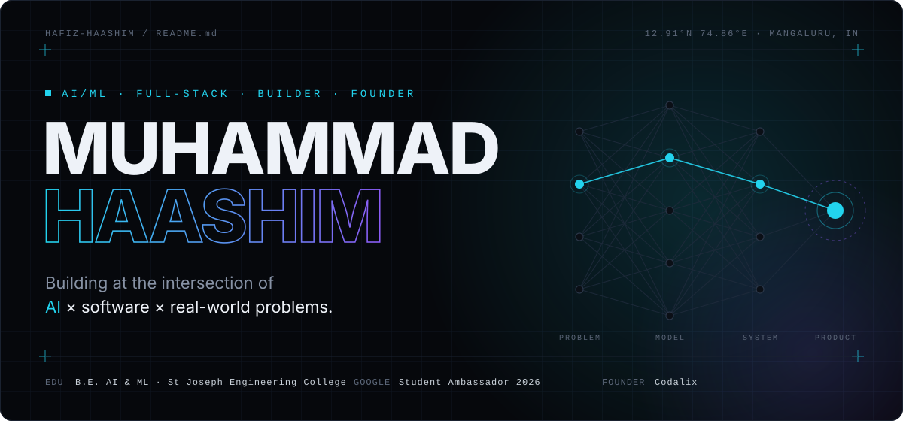
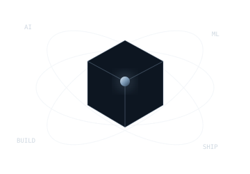

<table>
<tr>
<td width="26%" valign="top">

  

<h3 align="center">Haashim</h3>

AI/ML · Full-Stack · Builder

<b>Currently</b>

 Building AI-powered products
 Exploring systems & backend engineering
 Competing in hackathons
 Growing Codalix

  

<b>Education</b>

 B.E. AI & ML
 St Joseph Engineering College
  
Diploma in CSE
 Bearys Institute of Technology

<b>Connect</b>

 <a href="https://github.com/HAFIZ-HAASHIM">GitHub</a>
 <a href="https://www.linkedin.com/in/muhammad-haashim-49051828b">LinkedIn</a>
 <a href="https://codalix.in">Codalix</a>
 <a href="mailto:haashimmuhammad7@gmail.com">Email</a>

<b>Recognition</b>

 Hacksummit 2025 · Winner
 East India Blockchain Summit 2.0 · 3rd
 Medithon 4.0 · Top 10
 Google Student Ambassador · 2026

</td>

<td width="74%" valign="top">

  

  <a href="https://github.com/HAFIZ-HAASHIM">GitHub</a>
  &nbsp;·&nbsp;
  <a href="https://www.linkedin.com/in/muhammad-haashim-49051828b">LinkedIn</a>
  &nbsp;·&nbsp;
  <a href="https://codalix.in">Codalix</a>
  &nbsp;·&nbsp;
  <a href="mailto:haashimmuhammad7@gmail.com">Email</a>

<h3 align="center">About</h3>

<table>
<tr>
<td width="64%" valign="top">

I'm a second-year **B.E. Artificial Intelligence & Machine Learning** student who learns by building.

My work sits around **AI applications, full-stack systems, product experiments, automation, IoT and robotics**. I care less about collecting frameworks and more about taking an idea from a rough problem statement to something people can actually use.

I previously completed a Diploma in Computer Science & Engineering and spent that time building projects, competing in hackathons and leading technical activities.

</td>
<td width="36%" align="center" valign="middle">
  
</td>
</tr>
</table>

<h3 align="center">What I Build</h3>

<table>
<tr>
<td width="25%" align="center"><b>AI</b> Practical AI products</td>
<td width="25%" align="center"><b>SOFTWARE</b> Full-stack systems</td>
<td width="25%" align="center"><b>PRODUCTS</b> Ideas into usable tools</td>
<td width="25%" align="center"><b>HARDWARE</b> IoT & robotics</td>
</tr>
</table>

<h3 align="center">Technology</h3>

  

Also working with Vertex AI · Roboflow · Firestore · Twilio · Speech-to-Text · APIs

<h3 align="center">Selected Work</h3>

<table>
<tr>
<td width="50%" valign="top">

<b>GraamSehat</b> 
Offline-first rural healthcare platform.
  
JavaScript · Firebase · Firestore · PWA
  
<a href="https://github.com/HAFIZ-HAASHIM/GraamSehat">Repository →</a>
&nbsp;&nbsp;
<a href="https://graam-sehat.vercel.app">Live →</a>

</td>
<td width="50%" valign="top">

<b>ThermoShift</b> 
Heat-aware workforce scheduling using weather data and optimisation.
  
Python · FastAPI · React · OR-Tools
  
<a href="https://github.com/HAFIZ-HAASHIM/thermoshift">Repository →</a>
&nbsp;&nbsp;
<a href="https://thermoshift.vercel.app">Live →</a>

</td>
</tr>
<tr>
<td width="50%" valign="top">

<b>HarvestIQ</b> 
AI-assisted crop-selling and market insight prototype.
  
Node.js · Firebase · Twilio
  
<a href="https://github.com/HAFIZ-HAASHIM/HarvestIQ">Repository →</a>

</td>
<td width="50%" valign="top">

<b>Rezolvia</b> 
Dynamic college web platform.
  
PHP · MySQL · HTML · CSS
  
<a href="https://rezolvia.in">Live website →</a>

</td>
</tr>
</table>

<h3 align="center">GitHub Activity</h3>

  
  

  

<h3 align="center">Proof of Work</h3>

<table>
<tr>
<td width="33%" align="center"><b>Hacksummit 2025</b> Winner · PA College of Engineering</td>
<td width="33%" align="center"><b>East India Blockchain Summit 2.0</b> 3rd Place · IIT Kharagpur</td>
<td width="33%" align="center"><b>Medithon 4.0</b> Top 10 Finalist</td>
</tr>
<tr>
<td width="33%" align="center"><b>Google Student Ambassador</b> Class of 2026</td>
<td width="33%" align="center"><b>Academic Topper</b> Two consecutive years</td>
<td width="33%" align="center"><b>Google Programs</b> Solution Challenge · Agentic AI Day</td>
</tr>
</table>

<h3 align="center">Current Focus</h3>

<table>
<tr>
<td width="70%" valign="top">

<b>01 · AI ENGINEERING</b> 
Building practical AI systems and learning stronger model/application architecture.

  

<b>02 · SYSTEM DESIGN</b> 
Improving backend thinking, APIs, data flow and production-oriented engineering.

  

<b>03 · PRODUCT BUILDING</b> 
Turning real problems into small, useful products instead of stopping at prototypes.

</td>
<td width="30%" align="center" valign="middle">
  
</td>
</tr>
</table>

<h3 align="center">Codalix</h3>

  <b>Student-founded technology agency</b> · websites · digital products · practical solutions

  <a href="https://codalix.in">Visit Codalix →</a>

  BUILD · LEARN · SHIP · REPEAT

</td>
</tr>
</table>
