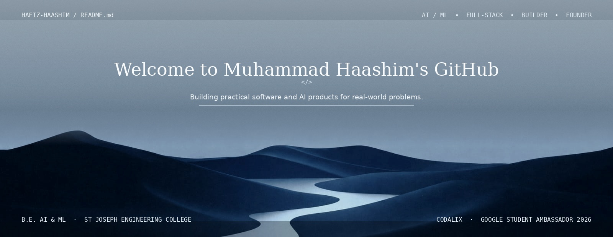
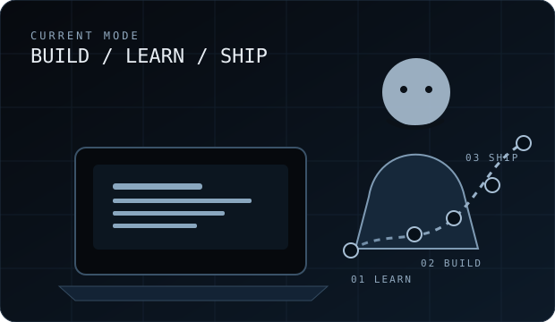

 

 

<h2 align="center"> <i>Technologies</i></h2>

  
   
  LANGUAGES

  
   
  FRONTEND

  
   
  BACKEND · DATA · CLOUD

  
   
  TOOLS · DEPLOYMENT · HARDWARE

  Vertex AI · Roboflow · Firestore · AI APIs · Speech-to-Text · IoT · Robotics

 

<h2 align="center"> <i>Statistics</i></h2>

  
  

  

 

<h2 align="center"> <i>About Me</i></h2>

<table>
<tr>
<td width="34%" align="center" valign="middle">
  
</td>
<td width="66%" valign="middle">

Hi, I'm <b>Muhammad Haashim</b> — a second-year <b>B.E. Artificial Intelligence & Machine Learning</b> student at <b>St Joseph Engineering College</b>.

I enjoy taking real problems and turning them into working software: AI-powered applications, full-stack products, automation, and hardware experiments.

Previously, I completed a <b>Diploma in Computer Science & Engineering</b> at Bearys Institute of Technology, where I was an <b>Academic Topper for two consecutive years</b>.

Right now I'm focused on getting better at the fundamentals while continuing to <b>build, compete, ship and learn</b>.

</td>
</tr>
</table>

 

<h2 align="center"> <i>Featured Work</i></h2>

<table>
<tr>
<td width="50%" valign="top">

### ◉ GraamSehat
**Offline-first rural healthcare suite**

Five connected applications for villagers, ASHA workers and administrators, designed for low-connectivity environments.

`JavaScript` `Firebase` `Firestore` `PWA`

<a href="https://github.com/HAFIZ-HAASHIM/GraamSehat">Repository →</a>
&nbsp; · &nbsp;
<a href="https://graam-sehat.vercel.app">Live Demo →</a>

</td>
<td width="50%" valign="top">

### ◈ ThermoShift
**Heat-aware workforce scheduling**

A decision-support system combining weather-aware logic and constraint optimisation for safer outdoor schedules.

`Python` `FastAPI` `React` `OR-Tools`

<a href="https://github.com/HAFIZ-HAASHIM/thermoshift">Repository →</a>
&nbsp; · &nbsp;
<a href="https://thermoshift.vercel.app">Live Demo →</a>

</td>
</tr>

<tr>
<td width="50%" valign="top">

### ◌ HarvestIQ
**AI crop-selling advisor**

Market-price forecasting, weather insights and alerts designed to help farmers decide when to sell.

`Node.js` `Firebase` `Twilio`

<a href="https://github.com/HAFIZ-HAASHIM/HarvestIQ">Repository →</a>

</td>
<td width="50%" valign="top">

### △ Rezolvia
**Dynamic college platform**

A practical college platform built with PHP and MySQL.

`PHP` `MySQL` `HTML` `CSS`

<a href="https://rezolvia.in/">Live Website →</a>

</td>
</tr>
</table>

<b>View more projects</b>

 

BlueGuard AI · Acadex · ClubMate · HemaScan · Project Kisan · WonderWing Travel & Tourism · Nxt Bus · School Lane · Line Following Robot · Maze Solver Robot

 

<h2 align="center"> <i>Achievements</i></h2>

<table>
<tr>
<td align="center" width="25%"><b>🏆</b> <b>Hacksummit 2025</b> Winner</td>
<td align="center" width="25%"><b>🥉</b> <b>East India Blockchain Summit 2.0</b> 3rd Place · IIT Kharagpur</td>
<td align="center" width="25%"><b>🏅</b> <b>Medithon 4.0</b> Top 10 Finalist</td>
<td align="center" width="25%"><b>🌐</b> <b>Google Student Ambassador</b> Class of 2026</td>
</tr>
</table>

 

<h2 align="center"> <i>Goals & Focus</i></h2>

<table>
<tr>
<td width="62%" valign="middle">

<b>01 · Deepen AI/ML</b> 
Strengthen fundamentals while building practical AI applications.

  

<b>02 · Become a stronger engineer</b> 
Improve backend architecture, systems thinking and production-quality development.

  

<b>03 · Build products</b> 
Turn ideas into usable, deployed products instead of leaving them as prototypes.

  

<b>04 · Grow Codalix</b> 
Build a serious student-founded technology agency.

  

<b>05 · Keep competing</b> 
Learn through hackathons, ambitious projects and real constraints.

</td>
<td width="38%" align="center" valign="middle">
  
</td>
</tr>
</table>

 

<h2 align="center">⚡ <i>Codalix</i></h2>

  <b>Student-founded technology agency.</b> 
  Building websites, digital products and practical technology solutions.

  

 

  <b>BUILD SOMETHING USEFUL.</b>
   
  AI · SOFTWARE · PRODUCTS · REAL-WORLD PROBLEMS
    
  <a href="https://github.com/HAFIZ-HAASHIM">GitHub</a>
  &nbsp;·&nbsp;
  <a href="https://www.linkedin.com/in/muhammad-haashim-49051828b">LinkedIn</a>
  &nbsp;·&nbsp;
  <a href="https://codalix.in">Codalix</a>
  &nbsp;·&nbsp;
  <a href="mailto:haashimmuhammad7@gmail.com">Email</a>

