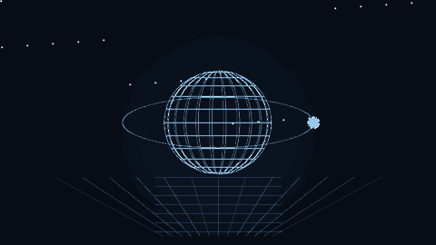
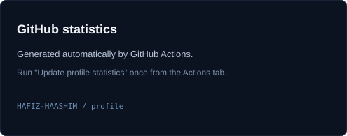
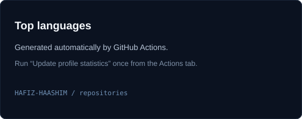

 

&nbsp;

&nbsp;

  

 

<table align="center" width="92%">
<tr>
<td width="58%" valign="middle">

### `hello, world.`

I'm **Haashim** — an AI & ML engineering student who likes building things that are actually useful.

I work across **AI/ML, full-stack development, computer vision and product engineering**. My favorite projects sit at the intersection of software, data and real-world problems.

 

**Currently:** building • experimenting • competing • learning

</td>
<td width="42%" align="center" valign="middle">

</td>
</tr>
</table>

 

<h2 align="center"> <i>What I Build</i></h2>

<table align="center" width="92%">
<tr>
<td width="33%" align="center">

**AI / ML**  
Computer vision · intelligent systems · applied AI

</td>
<td width="33%" align="center">

**FULL-STACK**  
Web apps · APIs · databases · product systems

</td>
<td width="33%" align="center">

**EXPERIMENTS**  
Hackathons · prototypes · robotics · new tech

</td>
</tr>
</table>

 

<h2 align="center"> <i>Tech Stack</i></h2>

  
  
  
  
  

  
  
  
  
  
  

  
  
  
  
  
  

 

<h2 align="center"> <i>GitHub Metrics</i></h2>

  
  
  

  
  

 

<h2 align="center"> <i>3D Contribution View</i></h2>

  

 

<h2 align="center"> <i>Beyond Code</i></h2>

<table align="center" width="92%">
<tr>
<td width="50%" valign="top">

**Hackathons & building**  
I enjoy turning rough ideas into working prototypes, especially when there is a real constraint, deadline or competition involved.

</td>
<td width="50%" valign="top">

**Learning & exploring**  
AI systems, product engineering, computer vision, robotics and whatever technology can make the next project more interesting.

</td>
</tr>
</table>

 

  Always building. Always learning. Always shipping.

  <a href="https://github.com/HAFIZ-HAASHIM">github</a> ·
  <a href="https://www.linkedin.com/in/muhammad-haashim-49051828b">linkedin</a> ·
  <a href="https://www.instagram.com/haashim.dev/">instagram</a>

