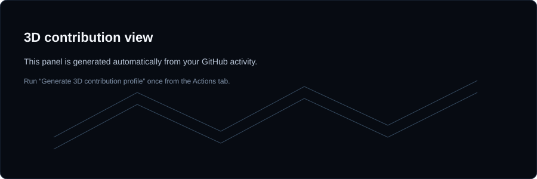

<!-- HERO BANNER -->

  

<!-- QUICK NAV & SOCIALS -->

&nbsp;

&nbsp;

&nbsp;

  

<!-- PROFILE HIGHLIGHT CARD -->
<table align="center" width="100%" style="border-collapse: separate; border-spacing: 0; border: 1px solid #1E293B; border-radius: 12px; background-color: #0B1220;">
<tr>
<td width="65%" valign="middle" style="padding: 24px 28px; text-align: left; border: none;">

<h3 style="margin-top: 0; margin-bottom: 8px; color: #FFFFFF; font-size: 20px;">
  Hi, I'm Haashim 👋
</h3>

  <b>AI & ML Engineering student</b> and software builder passionate about engineering intelligent systems, robust full-stack architectures, and computer vision applications that solve real-world problems.

  🔭 <b>Focus:</b> Agentic AI · Machine Learning · Computer Vision · Product Engineering 
  ⚡ <b>Approach:</b> First-principles thinking, clean architecture, and rapid prototyping

  
  &nbsp;
  

</td>

<td width="35%" align="center" valign="middle" style="padding: 20px; border: none;">
  
</td>
</tr>
</table>

 

<!-- ==================== FEATURED PROJECTS ==================== -->
### 🚀 Featured Engineering Projects

<table width="100%" style="border-collapse: collapse; border: 1px solid #1E293B;">
<thead>
<tr style="background-color: #0B1220; border-bottom: 2px solid #1E293B;">
  <th align="left" width="28%" style="padding: 10px 14px; color: #F8FAFC;">Project</th>
  <th align="left" width="52%" style="padding: 10px 14px; color: #F8FAFC;">Description & Impact</th>
  <th align="center" width="20%" style="padding: 10px 14px; color: #F8FAFC;">Core Stack</th>
</tr>
</thead>
<tbody>

<tr style="background-color: #080E1A; border-bottom: 1px solid #1E293B;">
  <td style="padding: 12px 14px;">
    <b><a href="https://github.com/HAFIZ-HAASHIM/project-kisan" style="color: #60A5FA; text-decoration: none;">🌾 Project-Kisan</a></b>
  </td>
  <td style="padding: 12px 14px; color: #94A3B8; font-size: 13.5px;">
    Autonomous agentic AI system for context-aware agricultural guidance and crop decision support. Built for <b>Google Agentic AI Day</b>.
  </td>
  <td align="center" style="padding: 12px 14px; color: #CBD5E1; font-size: 12px;">
    <code>TypeScript</code> · <code>AI Agents</code>
  </td>
</tr>

<tr style="background-color: #0B1220; border-bottom: 1px solid #1E293B;">
  <td style="padding: 12px 14px;">
    <b><a href="https://github.com/HAFIZ-HAASHIM/HarvestIQ" style="color: #60A5FA; text-decoration: none;">🌱 HarvestIQ</a></b>
  </td>
  <td style="padding: 12px 14px; color: #94A3B8; font-size: 13.5px;">
    AI-driven agri-fintech platform analyzing mandi price trends to generate short-term price forecasts, sell/wait recommendations, and weather risk alerts.
  </td>
  <td align="center" style="padding: 12px 14px; color: #CBD5E1; font-size: 12px;">
    <code>JavaScript</code> · <code>ML Models</code>
  </td>
</tr>

<tr style="background-color: #080E1A; border-bottom: 1px solid #1E293B;">
  <td style="padding: 12px 14px;">
    <b><a href="https://github.com/HAFIZ-HAASHIM/crowdsafe-AI" style="color: #60A5FA; text-decoration: none;">🛡️ CrowdSafe AI</a></b>
  </td>
  <td style="padding: 12px 14px; color: #94A3B8; font-size: 13.5px;">
    Real-time crowd density monitoring and stampede prevention system using computer vision to detect risk thresholds in public venues early.
  </td>
  <td align="center" style="padding: 12px 14px; color: #CBD5E1; font-size: 12px;">
    <code>Python</code> · <code>Computer Vision</code>
  </td>
</tr>

<tr style="background-color: #0B1220; border-bottom: 1px solid #1E293B;">
  <td style="padding: 12px 14px;">
    <b><a href="https://github.com/HAFIZ-HAASHIM/thermoshift" style="color: #60A5FA; text-decoration: none;">🌡️ ThermoShift</a></b>
  </td>
  <td style="padding: 12px 14px; color: #94A3B8; font-size: 13.5px;">
    Intelligent heat-aware workforce scheduling system utilizing real-time environmental telemetry to mitigate heat strain risks for field workers.
  </td>
  <td align="center" style="padding: 12px 14px; color: #CBD5E1; font-size: 12px;">
    <code>TypeScript</code> · <code>Decision AI</code>
  </td>
</tr>

<tr style="background-color: #080E1A; border-bottom: 1px solid #1E293B;">
  <td style="padding: 12px 14px;">
    <b><a href="https://github.com/HAFIZ-HAASHIM/GraamSehat" style="color: #60A5FA; text-decoration: none;">💖 GraamSehat</a></b>
  </td>
  <td style="padding: 12px 14px; color: #94A3B8; font-size: 13.5px;">
    Decentralized rural healthcare and telemedicine suite built to bridge healthcare delivery gaps in underserved communities.
  </td>
  <td align="center" style="padding: 12px 14px; color: #CBD5E1; font-size: 12px;">
    <code>JavaScript</code> · <code>HealthTech</code>
  </td>
</tr>

<tr style="background-color: #0B1220;">
  <td style="padding: 12px 14px;">
    <b><a href="https://github.com/HAFIZ-HAASHIM/blueGuard-AI" style="color: #60A5FA; text-decoration: none;">🔵 BlueGuard AI</a></b>
  </td>
  <td style="padding: 12px 14px; color: #94A3B8; font-size: 13.5px;">
    Digital threat monitoring platform delivering automated anomaly analysis and proactive security intelligence for modern web architectures.
  </td>
  <td align="center" style="padding: 12px 14px; color: #CBD5E1; font-size: 12px;">
    <code>TypeScript</code> · <code>Cyber AI</code>
  </td>
</tr>

</tbody>
</table>

 

<!-- ==================== ACHIEVEMENTS & CREDIBILITY ==================== -->
### 🏆 Achievements & Milestones

<table width="100%" style="border-collapse: separate; border-spacing: 10px 0; border: none;">
<tr>

<td width="33.3%" valign="top" style="background-color: #0B1220; border: 1px solid #1E293B; border-radius: 10px; padding: 16px;">
  

    🎓 Academic Excellence
  

  

    Earned a <b>9.89 CGPA</b> in Computer Science & Engineering at Bearys Institute of Technology with recognition as <b>Academic Topper</b>.
  

</td>

<td width="33.3%" valign="top" style="background-color: #0B1220; border: 1px solid #1E293B; border-radius: 10px; padding: 16px;">
  

    🤖 Google Agentic AI Day
  

  

    Architected and deployed <b>Project-Kisan</b>, an autonomous multi-agent system providing contextual decision intelligence for agriculture.
  

</td>

<td width="33.3%" valign="top" style="background-color: #0B1220; border: 1px solid #1E293B; border-radius: 10px; padding: 16px;">
  

    ⚔️ Hackathon Builder
  

  

    Active hackathon competitor specializing in rapid-prototyping high-impact AI/ML, computer vision, and public-safety solutions under tight deadlines.
  

</td>

</tr>
</table>

 

<!-- ==================== TECH STACK ==================== -->
### 🛠️ Technical Competencies

<table width="100%" style="border-collapse: collapse; border: 1px solid #1E293B; background-color: #0B1220;">
<tbody>

<tr style="border-bottom: 1px solid #1E293B;">
  <td width="26%" style="padding: 12px 16px; color: #F8FAFC; font-weight: 600;">
    Languages
  </td>
  <td width="74%" style="padding: 12px 16px;">
    
    &nbsp;
    
    &nbsp;
    
    &nbsp;
    
    &nbsp;
    
    &nbsp;
    
  </td>
</tr>

<tr style="border-bottom: 1px solid #1E293B;">
  <td width="26%" style="padding: 12px 16px; color: #F8FAFC; font-weight: 600;">
    AI / ML & Vision
  </td>
  <td width="74%" style="padding: 12px 16px;">
    
    &nbsp;
    
    &nbsp;
    
    &nbsp;
    
    &nbsp;
    
  </td>
</tr>

<tr style="border-bottom: 1px solid #1E293B;">
  <td width="26%" style="padding: 12px 16px; color: #F8FAFC; font-weight: 600;">
    Full-Stack & Backend
  </td>
  <td width="74%" style="padding: 12px 16px;">
    
    &nbsp;
    
    &nbsp;
    
    &nbsp;
    
    &nbsp;
    
  </td>
</tr>

<tr>
  <td width="26%" style="padding: 12px 16px; color: #F8FAFC; font-weight: 600;">
    Databases, Cloud & Tools
  </td>
  <td width="74%" style="padding: 12px 16px;">
    
    &nbsp;
    
    &nbsp;
    
    &nbsp;
    
    &nbsp;
    
    &nbsp;
    
  </td>
</tr>

</tbody>
</table>

 

<!-- ==================== GITHUB ANALYTICS ==================== -->
### 📊 GitHub Activity & Analytics

<!-- TOP ROW STATS -->
<table width="100%" style="border-collapse: separate; border-spacing: 8px 0; border: none;">
<tr>
<td width="50%" align="center" style="border: none; padding: 0;">
  
</td>
<td width="50%" align="center" style="border: none; padding: 0;">
  
</td>
</tr>
</table>

 

<!-- ACTIVITY GRAPH -->

  

<!-- STREAK STATS -->

  

<!-- 3D CONTRIBUTION NIGHT VIEW -->

 

<!-- ==================== FOOTER ==================== -->

  <i>Engineering with curiosity · Building with intent · Shipping with speed</i>

  <a href="https://github.com/HAFIZ-HAASHIM" style="color: #94A3B8; text-decoration: none;">GitHub</a>
  &nbsp;·&nbsp;
  <a href="https://www.linkedin.com/in/muhammad-haashim-49051828b" style="color: #94A3B8; text-decoration: none;">LinkedIn</a>
  &nbsp;·&nbsp;
  <a href="https://www.instagram.com/haashim.dev/" style="color: #94A3B8; text-decoration: none;">Instagram</a>
  &nbsp;·&nbsp;
  <a href="mailto:hafizhaashim786@gmail.com" style="color: #94A3B8; text-decoration: none;">Email</a>

