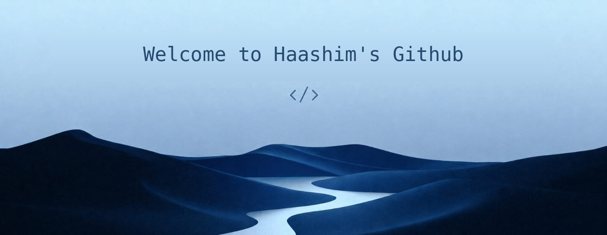
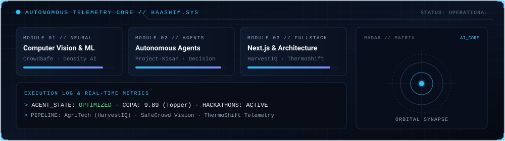

<!-- ==================== HERO BANNER ==================== -->

  

<!-- ==================== SOCIAL / CONTACT BAR ==================== -->

&nbsp;

&nbsp;

&nbsp;

  

<!-- ==================== ABOUT & PROFILE SHOWCASE ==================== -->
<table align="center" width="100%" style="border-collapse: separate; border-spacing: 0; border: 1px solid #1E293B; border-radius: 12px; background-color: #0B1220;">
<tr>
<td width="65%" valign="middle" style="padding: 24px 28px; text-align: left; border: none;">

<h3 style="margin-top: 0; margin-bottom: 8px; color: #FFFFFF; font-size: 21px;">
  Hi, I'm Haashim 👋
</h3>

  <b>AI & ML Engineering student</b> (2nd Year B.E. at <i>St Joseph Engineering College</i> · previously CS Diploma at <i>Bearys Institute of Technology</i>). Technical builder with an <b>entrepreneurial mindset</b>, combining artificial intelligence, computer vision, full-stack development, and product engineering to turn real problems into scalable software products.

  🔭 <b>Core Focus:</b> AI & ML · Computer Vision · Full-Stack Architecture · Product Engineering 
  ⚡ <b>Core Loop:</b> BUILD ➔ EXPERIMENT ➔ COMPETE ➔ LEARN ➔ SHIP

  
  &nbsp;
  
  &nbsp;
  

</td>

<td width="35%" align="center" valign="middle" style="padding: 20px; border: none;">
  
</td>
</tr>
</table>

 

<!-- ==================== INDUSTRY EXPERIENCE / INTERNSHIPS ==================== -->
### 💼 Industry & Startup Experience

<table width="100%" style="border-collapse: separate; border-spacing: 10px 0; border: none;">
<tr>

<td width="33.3%" valign="top" style="background-color: #0B1220; border: 1px solid #1E293B; border-radius: 10px; padding: 16px;">
  
Software Engineering

  
Software Developer Intern

  
GD Edu Tech Pvt. Ltd.

  

    Contributed to full-stack feature development, modular web applications, and backend logic.
  

</td>

<td width="33.3%" valign="top" style="background-color: #0B1220; border: 1px solid #1E293B; border-radius: 10px; padding: 16px;">
  
Security Engineering

  
Cybersecurity Intern

  
Teknowgrade Pvt. Ltd.

  

    Analyzed threat models, application vulnerabilities, and implemented secure engineering workflows.
  

</td>

<td width="33.3%" valign="top" style="background-color: #0B1220; border: 1px solid #1E293B; border-radius: 10px; padding: 16px;">
  
Startups &amp; Incubation

  
Startup &amp; Incubation Intern

  
Yenepoya Technology Incubator

  

    Gained hands-on exposure to early-stage venture building, product-market validation, and startup operations.
  

</td>

</tr>
</table>

 

<!-- ==================== FUTURISTIC TELEMETRY HUD ==================== -->
### ⚡ Autonomous Telemetry & Core Modules

  

 

<!-- ==================== FEATURED PROJECTS ==================== -->
### 🚀 Selected Engineering Projects

<table width="100%" style="border-collapse: collapse; border: 1px solid #1E293B;">
<thead>
<tr style="background-color: #0B1220; border-bottom: 2px solid #1E293B;">
  <th align="left" width="28%" style="padding: 10px 14px; color: #F8FAFC;">Project</th>
  <th align="left" width="52%" style="padding: 10px 14px; color: #F8FAFC;">Description &amp; Impact</th>
  <th align="center" width="20%" style="padding: 10px 14px; color: #F8FAFC;">Core Stack</th>
</tr>
</thead>
<tbody>

<tr style="background-color: #080E1A; border-bottom: 1px solid #1E293B;">
  <td style="padding: 12px 14px;">
    <b><a href="https://github.com/HAFIZ-HAASHIM/project-kisan" style="color: #60A5FA; text-decoration: none;">🌾 Project-Kisan</a></b>
  </td>
  <td style="padding: 12px 14px; color: #94A3B8; font-size: 13.5px;">
    Autonomous multi-agent system delivering context-aware agricultural intelligence and crop decision guidance. Built for <b>Google Agentic AI Day</b>.
  </td>
  <td align="center" style="padding: 12px 14px; color: #CBD5E1; font-size: 12px;">
    <code>TypeScript</code> · <code>Agentic AI</code>
  </td>
</tr>

<tr style="background-color: #0B1220; border-bottom: 1px solid #1E293B;">
  <td style="padding: 12px 14px;">
    <b><a href="https://github.com/HAFIZ-HAASHIM" style="color: #60A5FA; text-decoration: none;">🩸 HemaScan</a></b>
  </td>
  <td style="padding: 12px 14px; color: #94A3B8; font-size: 13.5px;">
    AI-powered hematology &amp; medical computer vision diagnostics engine analyzing blood cell microscopic imagery for rapid anomaly detection.
  </td>
  <td align="center" style="padding: 12px 14px; color: #CBD5E1; font-size: 12px;">
    <code>Python</code> · <code>Computer Vision</code>
  </td>
</tr>

<tr style="background-color: #080E1A; border-bottom: 1px solid #1E293B;">
  <td style="padding: 12px 14px;">
    <b><a href="https://github.com/HAFIZ-HAASHIM/blueGuard-AI" style="color: #60A5FA; text-decoration: none;">🔵 BlueGuard AI</a></b>
  </td>
  <td style="padding: 12px 14px; color: #94A3B8; font-size: 13.5px;">
    Digital threat monitoring platform delivering automated anomaly analysis and proactive security telemetry for modern web architectures.
  </td>
  <td align="center" style="padding: 12px 14px; color: #CBD5E1; font-size: 12px;">
    <code>TypeScript</code> · <code>Cyber AI</code>
  </td>
</tr>

<tr style="background-color: #0B1220; border-bottom: 1px solid #1E293B;">
  <td style="padding: 12px 14px;">
    <b><a href="https://github.com/HAFIZ-HAASHIM" style="color: #60A5FA; text-decoration: none;">🎓 Acadex</a></b>
     
    ⚡ Evolved from School Lane
  </td>
  <td style="padding: 12px 14px; color: #94A3B8; font-size: 13.5px;">
    Modernized, full-modular education ERP and academic workflow resolution platform streamlining institutional administration, student tracking, and operations.
  </td>
  <td align="center" style="padding: 12px 14px; color: #CBD5E1; font-size: 12px;">
    <code>React</code> · <code>Node.js</code> · <code>Vite</code>
  </td>
</tr>

<tr style="background-color: #080E1A; border-bottom: 1px solid #1E293B;">
  <td style="padding: 12px 14px;">
    <b><a href="https://github.com/HAFIZ-HAASHIM/GraamSehat" style="color: #60A5FA; text-decoration: none;">💖 GraamSehat</a></b>
  </td>
  <td style="padding: 12px 14px; color: #94A3B8; font-size: 13.5px;">
    Decentralized rural digital healthcare &amp; telemedicine ecosystem engineered to bridge healthcare delivery gaps in underserved communities.
  </td>
  <td align="center" style="padding: 12px 14px; color: #CBD5E1; font-size: 12px;">
    <code>JavaScript</code> · <code>HealthTech</code>
  </td>
</tr>

<tr style="background-color: #0B1220;">
  <td style="padding: 12px 14px;">
    <b><a href="https://github.com/HAFIZ-HAASHIM" style="color: #60A5FA; text-decoration: none;">🤖 Autonomous Robotics</a></b>
  </td>
  <td style="padding: 12px 14px; color: #94A3B8; font-size: 13.5px;">
    Engineered sensor-driven autonomous line-following and maze-solving robotic vehicles with embedded control algorithms and real-time feedback loops.
  </td>
  <td align="center" style="padding: 12px 14px; color: #CBD5E1; font-size: 12px;">
    <code>C++</code> · <code>Robotics</code> · <code>Arduino</code>
  </td>
</tr>

</tbody>
</table>

 

<!-- ==================== HACKATHONS & ACHIEVEMENTS ==================== -->
### 🏆 Hackathons & Key Milestones

<table width="100%" style="border-collapse: separate; border-spacing: 10px 0; border: none;">
<tr>

<td width="33.3%" valign="top" style="background-color: #0B1220; border: 1px solid #1E293B; border-radius: 10px; padding: 16px;">
  

    🏆 3X Hackathon Winner
  

  

    • <b>Winner (1st)</b> — HackSummit 2025 (PACE · ₹10k) 
    • <b>3rd Place</b> — East India Blockchain Summit 2.0 (IIT Kharagpur · ₹50k) 
    • <b>Awardee</b> — Code4Change (Project Sankalp · Yenepoya) 
    • <b>Top 10 Finalist</b> — Medithon 4.0
  

</td>

<td width="33.3%" valign="top" style="background-color: #0B1220; border: 1px solid #1E293B; border-radius: 10px; padding: 16px;">
  

    🌐 Google Developer Programs
  

  

    • <b>Google Student Ambassador (GSA) 2026</b> 
    • <b>Google Solution Challenge</b> Participant 
    • <b>Google Agentic AI Day</b> Project Builder
  

</td>

<td width="33.3%" valign="top" style="background-color: #0B1220; border: 1px solid #1E293B; border-radius: 10px; padding: 16px;">
  

    🎓 Leadership &amp; Academics
  

  

    • <b>2× Academic Topper Award</b> (Two consecutive academic years) 
    • <b>President</b> — D-CODEX Technical Club (Organized technical workshops &amp; hackathons)
  

</td>

</tr>
</table>

 

<!-- ==================== TECH STACK ==================== -->
### 🛠️ Technical Competencies

<table width="100%" style="border-collapse: collapse; border: 1px solid #1E293B; background-color: #0B1220;">
<tbody>

<tr style="border-bottom: 1px solid #1E293B;">
  <td width="26%" style="padding: 12px 16px; color: #F8FAFC; font-weight: 600;">
    Languages
  </td>
  <td width="74%" style="padding: 12px 16px;">
    
    &nbsp;
    
    &nbsp;
    
    &nbsp;
    
    &nbsp;
    
    &nbsp;
    
    &nbsp;
    
  </td>
</tr>

<tr style="border-bottom: 1px solid #1E293B;">
  <td width="26%" style="padding: 12px 16px; color: #F8FAFC; font-weight: 600;">
    AI / ML &amp; Vision
  </td>
  <td width="74%" style="padding: 12px 16px;">
    
    &nbsp;
    
    &nbsp;
    
    &nbsp;
    
    &nbsp;
    
    &nbsp;
    
  </td>
</tr>

<tr style="border-bottom: 1px solid #1E293B;">
  <td width="26%" style="padding: 12px 16px; color: #F8FAFC; font-weight: 600;">
    Frontend &amp; Full-Stack
  </td>
  <td width="74%" style="padding: 12px 16px;">
    
    &nbsp;
    
    &nbsp;
    
    &nbsp;
    
    &nbsp;
    
    &nbsp;
    
  </td>
</tr>

<tr>
  <td width="26%" style="padding: 12px 16px; color: #F8FAFC; font-weight: 600;">
    Databases, Cloud &amp; Tools
  </td>
  <td width="74%" style="padding: 12px 16px;">
    
    &nbsp;
    
    &nbsp;
    
    &nbsp;
    
    &nbsp;
    
    &nbsp;
    
    &nbsp;
    
    &nbsp;
    
  </td>
</tr>

</tbody>
</table>

 

<!-- ==================== GITHUB ANALYTICS & STREAK ==================== -->
### 📊 GitHub Activity & Analytics

<!-- TOP ROW STATS & STREAK BOXES -->
<table width="100%" style="border-collapse: separate; border-spacing: 12px 0; border: none;">
<tr>

<td width="50%" align="center" valign="top" style="border: none; padding: 0;">
  
</td>

<td width="50%" align="center" valign="top" style="border: none; padding: 0;">
  
</td>

</tr>
</table>

 

<!-- TOP LANGUAGES BREAKDOWN -->
<table width="100%" style="border-collapse: separate; border-spacing: 12px 0; border: none;">
<tr>
<td width="50%" align="center" valign="top" style="border: none; padding: 0;">
  
</td>
<td width="50%" align="center" valign="top" style="border: none; padding: 0;">
  
</td>
</tr>
</table>

 

<!-- ==================== FOOTER ==================== -->

  <i>Building technology · Exploring ventures · Shipping real products</i>

  <a href="https://github.com/HAFIZ-HAASHIM" style="color: #94A3B8; text-decoration: none;">GitHub</a>
  &nbsp;·&nbsp;
  <a href="https://www.linkedin.com/in/muhammad-haashim-49051828b" style="color: #94A3B8; text-decoration: none;">LinkedIn</a>
  &nbsp;·&nbsp;
  <a href="https://www.instagram.com/haashim.dev/" style="color: #94A3B8; text-decoration: none;">Instagram</a>
  &nbsp;·&nbsp;
  <a href="mailto:haashimmuhammad7@gmail.com" style="color: #94A3B8; text-decoration: none;">Email</a>

